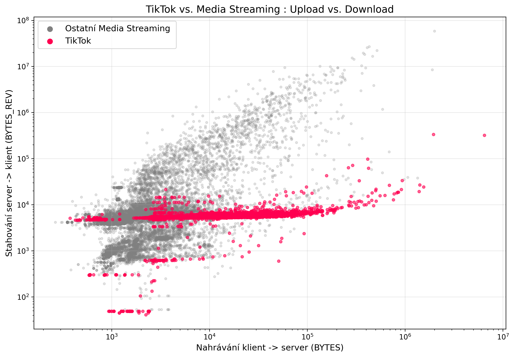
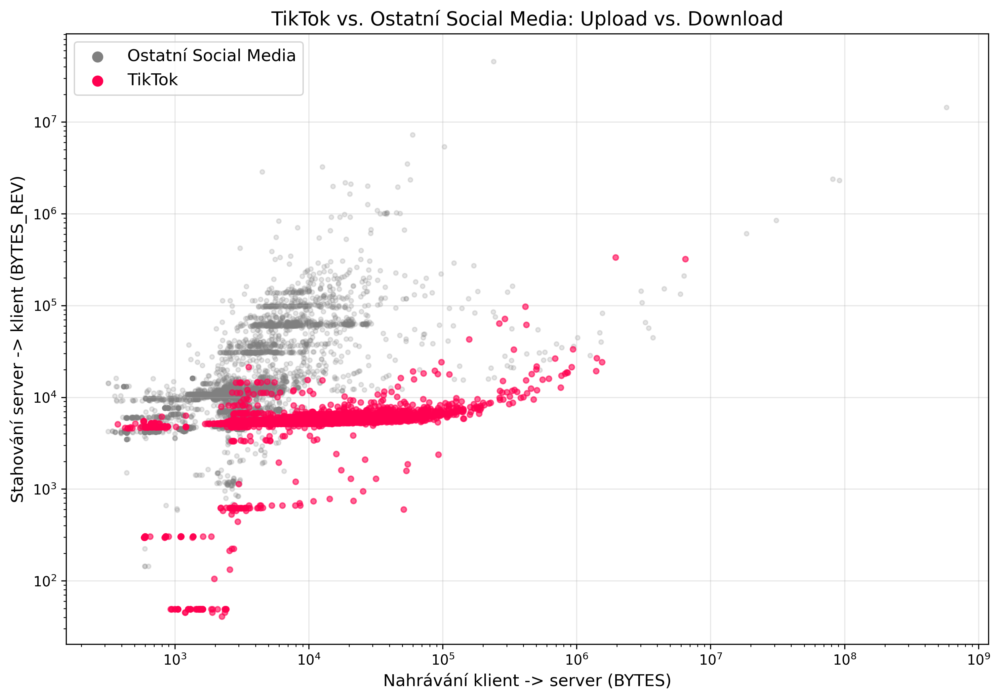

# TikTok Side-Channel Analysis


Behavioral fingerprinting of encrypted TikTok traffic using statistical analysis and machine learning on the **CESNET-TLS22** dataset.

This research demonstrates that TikTok can be reliably identified from encrypted network traffic without decrypting TLS payloads. By analyzing flow-level metadata and statistical side channels, it is possible to extract a distinctive behavioral fingerprint unique to the application.

---

# Overview

Modern applications increasingly rely on encrypted communication, making traditional Deep Packet Inspection ineffective.

However, encrypted traffic still exposes statistical metadata such as packet sizes, flow duration and transfer asymmetry. These side channels may uniquely characterize an application even when payload inspection is impossible.

The objective of this research was to investigate whether TikTok traffic exhibits a reproducible behavioral fingerprint distinguishable from other Internet services.

---

# Dataset

- Dataset: **CESNET-TLS22**
- Traffic Type: TLS encrypted flows
- Analysis Environment: Jupyter Notebook

Libraries used:

- pandas
- NumPy
- matplotlib
- seaborn
- scikit-learn

---

# Methodology

The analysis followed four major stages:

1. Extract TikTok flows from the CESNET-TLS22 dataset.
2. Train a Random Forest classifier to determine feature importance.
3. Analyze statistical properties of encrypted traffic.
4. Compare TikTok against competing traffic categories.

---

# Feature Importance

A Random Forest classifier was trained to identify which flow attributes provide the greatest predictive value.


## Findings

The dominant feature is **BYTES_REV**, representing the amount of data transferred from the server to the client.

The second most important feature is upload volume (**BYTES**), confirming the hypothesis that TikTok primarily reveals itself through its aggressive video streaming behavior.

---

# Behavioral Fingerprint

## Download Distribution

Kernel Density Estimation (KDE) was used to compare download distributions.


### Observation

Unlike ordinary Internet traffic, TikTok demonstrates highly standardized download sizes.

Instead of continuously transferring data, the application aggressively prefetches fixed-size video chunks, producing a narrow and repetitive statistical distribution.

---

## Flow Duration

Connection duration was analyzed using the same statistical methodology.


### Observation

General web traffic exhibits broad variability.

TikTok instead creates two dominant peaks corresponding to its characteristic workflow:

- Open connection
- Download video chunk
- Close connection
- Wait for user interaction

This results in a highly machine-like communication pattern.

---

# Category Comparison

## TikTok vs Media Streaming

TikTok was compared against other Media Streaming services such as YouTube and Netflix.



### Observation

Traditional streaming platforms produce a continuous relationship between upload and download traffic.

TikTok instead forms dense horizontal clusters, suggesting fixed download segment sizes largely independent of request size.

---

## TikTok vs Social Media

TikTok was also compared against applications categorized as Social Media.



### Observation

Traditional social media applications generate a balanced upload/download relationship.

TikTok exhibits highly asymmetric traffic dominated by continuous downstream video buffering.

---

# Results

The analysis demonstrates that encrypted traffic metadata alone contains sufficient information to distinguish TikTok from other Internet applications.

Key distinguishing characteristics include:

- Download-heavy traffic asymmetry
- Fixed-size video chunking
- Characteristic connection duration
- Strong statistical regularity

Even relatively simple machine learning algorithms such as Random Forest can successfully identify these characteristics.

---

# Repository Structure

```
analysis.ipynb               Complete Jupyter Notebook
README.md                    Project documentation

images/
├── feature_importance.png
├── download_distribution.png
├── flow_duration.png
├── tiktok_vs_media_streaming.png
└── tiktok_vs_social_media.png
```

---

# Technologies

- Python
- Jupyter Notebook
- pandas
- NumPy
- matplotlib
- seaborn
- scikit-learn

---

# Disclaimer

This repository contains the analysis code and generated visualizations only.

The CESNET-TLS22 dataset is not redistributed and remains the property of CESNET.
